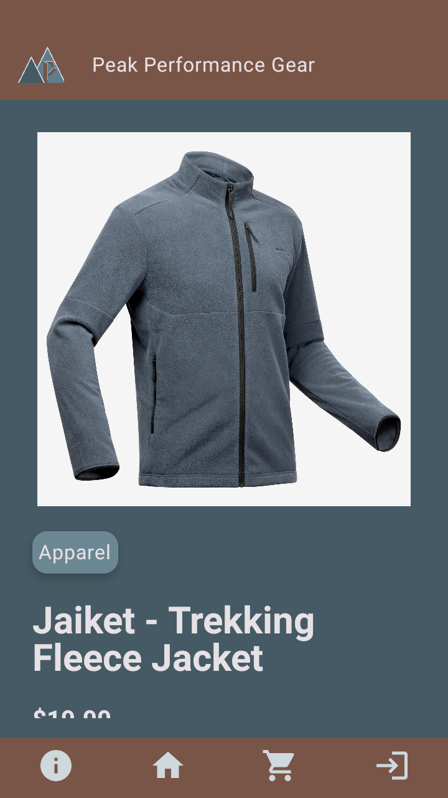
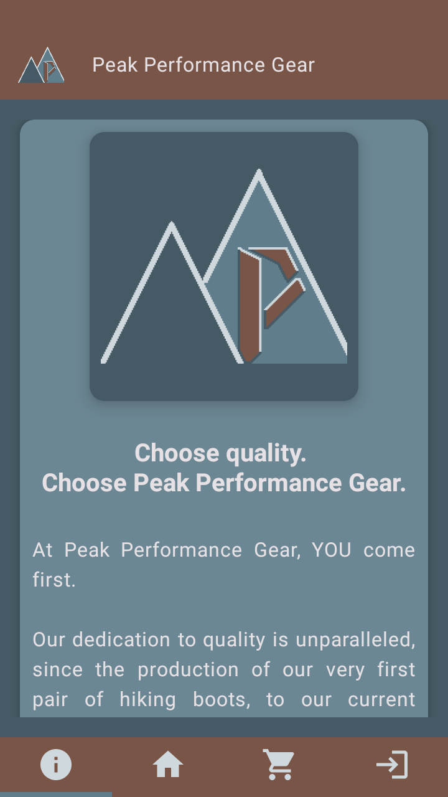
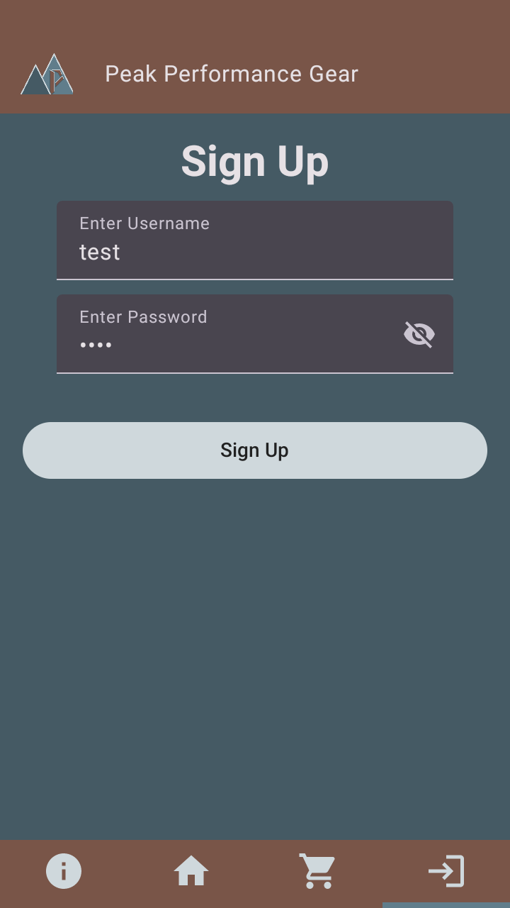

# Pairwork Programming Assignment

## Requirements
1. Main page : Catalog of sports equipment (no log in)
2. Scrollable, items displayed as cards with images, names, prices
3. Clicking on an item leads to page with details (category, brand, size, price, description) User reviews can also be entered/viewed here
5. Section about PPG!!!
6. Contact info for customer support must be easily accessible
7. Sign up page, validation checks for username and password

## Additional notes
- Hardcode data
- Use everything and more!!!11!!11!
- Add page for successful payment
- Filter and search functionality
- 20 sample items:
  - Name
  - Image
  - Description
  - Category
  - Brand
  - Size
  - Price
- Validation checks:
  - Username:
    - Length from 3 to 15 (inclusive)
    - No spaces or special characters
    - Unique
  - Password:
    - Length at least 8
    - Contains at least 1 uppercase, lowercase, digit and special character

## Report
- Summary
- Documentation
- Individual reflections

## Scenes
- Main page  

- Product details  

- Company details & contact info  

- Sign up page  

- Payment page (cart system?)  

## Theme

## Task allocation
### Gun Rui
- Art
- Themes
- Summary
- Product details (DONE!)
- Company details & contact info (DONE!)
### Jayden
- Documentation
- Main page (DONE!)
- Sign up page (DONE!)
- Payment page (DONE!)
### Current TODO:
- Continue populating JSON mock data
- Source images for products
- Implement dynamic image loading for product details page
- Generate v1.0.1 release APK
